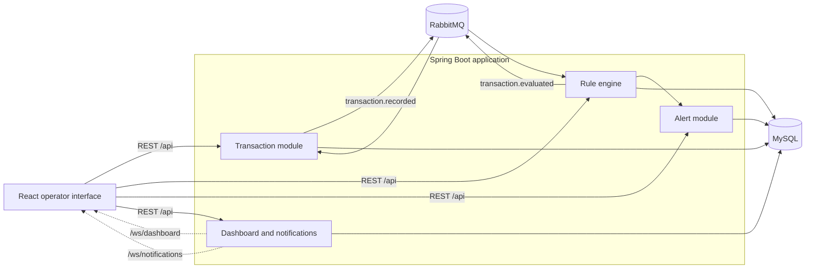

# Transaction Monitoring

Transaction Monitoring is a full-stack training project built by **Team Know Your Colleagues**. It records transactions, evaluates them against configurable risk rules, generates alerts, supports an auditable alert lifecycle, and presents operational data through a real-time dashboard.

The application demonstrates a complete asynchronous business flow:

```text
Transaction created as PENDING
        ↓
transaction.recorded event published to RabbitMQ
        ↓
Enabled monitoring rules evaluate the transaction
        ↓
No rule matched                    At least one rule matched
PENDING → NORMAL                   Alert created + PENDING → ABNORMAL
        ↓                                      ↓
WebSocket notification and dashboard update sent to the browser
```

> This repository is an educational project. Authentication and multi-user operator management are intentionally outside the current scope.

## Table of Contents

- [Features](#features)
- [System Architecture](#system-architecture)
- [Technology Stack](#technology-stack)
- [Business Workflows](#business-workflows)
- [Project Structure](#project-structure)
- [Getting Started](#getting-started)
- [Configuration](#configuration)
- [API Overview](#api-overview)
- [WebSocket Endpoints](#websocket-endpoints)
- [Demo and Seed Data](#demo-and-seed-data)
- [Testing](#testing)
- [Docker](#docker)
- [CI/CD](#cicd)
- [Development Workflow](#development-workflow)
- [Documentation](#documentation)
- [Known Limitations and Future Work](#known-limitations-and-future-work)
- [Team](#team)
- [Security](#security)
- [License](#license)

## Features

### Transactions

- Create a single transaction through the REST API or web interface.
- Generate a unique business transaction reference on the backend.
- Persist new transactions with the `PENDING` status before rule evaluation.
- Search with account, payee, amount range, transaction-time range, and status filters.
- Browse results with zero-based pagination and a maximum page size of 100.
- View complete transaction details.
- Track evaluation results from `PENDING` to `NORMAL` or `ABNORMAL`.

### Monitoring Rules

- Create, view, update, enable, disable, and delete monitoring rules.
- Filter rules by keyword, type, severity, and enabled status.
- Protect updates with optimistic locking.
- Evaluate four configurable rule types:

| Rule type | Purpose | Main parameters |
| --- | --- | --- |
| `AMOUNT_THRESHOLD` | Flags a single transaction above a configured amount | Currency, threshold amount |
| `VELOCITY` | Flags excessive transaction frequency for one account | Transaction count, time window |
| `NEW_PAYEE` | Flags the first payment from an account to a payee | No type-specific parameter |
| `DAILY_LIMIT` | Flags the first debit that takes an account above its daily total | Currency, daily limit amount |

### Alerts

- Create one alert per matched rule and triggering transaction.
- Preserve the rule name and severity used when the alert was created.
- Display related transactions and status history.
- Filter alerts by status, severity, account, and creation time.
- Manage the full lifecycle with validation and optimistic locking.
- Require resolution notes when closing or dismissing an alert.

### Real-Time Dashboard and Notifications

- Show open and acknowledged alert counts.
- Show today's alert total and its change from the previous day.
- Show average resolution time against a 30-minute target.
- Chart today's transaction **count** by UTC hour.
- Group alerts by severity and lifecycle status.
- Chart the seven-day first-response-time trend.
- Show the five most recent triggered alerts.
- Push transaction-status and new-alert notifications to the operator.
- Navigate from a notification directly to the related transaction or alert.

### Developer Experience

- Interactive OpenAPI documentation through Swagger UI.
- Unified exception responses for validation, not-found, and conflict errors.
- MyBatis-Plus pagination and optimistic locking.
- SQL schema and linked demo-data scripts.
- Automated backend tests, frontend linting, and production builds.
- Docker images for backend and frontend delivery.
- GitHub Actions CI/CD with an explicit repository-level enable switch.

## System Architecture

The project is a modular Spring Boot application with a separate React frontend. RabbitMQ decouples transaction intake from rule evaluation, while native WebSocket endpoints deliver live operational updates.



RabbitMQ uses two durable direct exchanges and two durable queues:

| Exchange / queue | Routing key | Responsibility |
| --- | --- | --- |
| `transaction.events` → `rule.evaluation` | `transaction.recorded` | Sends committed transaction lists to the rule engine |
| `rule.evaluation.results` → `transaction.status.update` | `transaction.evaluated` | Returns rule results to the transaction module |

Transaction events are published only after the database transaction has committed. The current event payload supports a transaction list, allowing the consumer contract to handle one or more transactions.

## Technology Stack

| Layer | Technology |
| --- | --- |
| Backend | Java 21, Spring Boot 4.1.0, Spring MVC, Bean Validation |
| Persistence | MySQL 8.x, MyBatis-Plus 3.5.17 |
| Messaging | RabbitMQ, Spring AMQP, JSON events |
| Real-time communication | Spring WebSocket, browser WebSocket API |
| API documentation | Springdoc OpenAPI, Swagger UI |
| Frontend | React 19, Vite 8, Ant Design 6, Axios, Lucide React |
| Observability | Spring Boot Actuator, Micrometer Prometheus registry |
| Build tooling | Maven, npm, Docker multi-stage builds |
| CI/CD | GitHub Actions, GitHub Container Registry |

## Business Workflows

### Transaction Evaluation

```text
POST /api/transactions
  → validate request
  → generate transactionRef
  → save transaction as PENDING
  → commit database transaction
  → publish transaction.recorded
  → evaluate all enabled rules
  → create alerts for matched rules
  → publish transaction.evaluated
  → update PENDING to NORMAL or ABNORMAL
  → notify connected browsers
```

Transaction status rules:

```text
PENDING -- CLEARED --> NORMAL
PENDING -- FLAGGED --> ABNORMAL
```

Final statuses are not overwritten by duplicate or late evaluation results.

### Alert Lifecycle

```text
OPEN → ACKNOWLEDGED → INVESTIGATING → CLOSED
  └───────────────→ DISMISSED ←──────────────┘
```

Valid transitions are:

- `OPEN` → `ACKNOWLEDGED` or `DISMISSED`
- `ACKNOWLEDGED` → `INVESTIGATING` or `DISMISSED`
- `INVESTIGATING` → `CLOSED` or `DISMISSED`
- `CLOSED` and `DISMISSED` are terminal states

Every transition is recorded in `alert_history`. Closing or dismissing an alert requires notes.

## Project Structure

```text
.
├── .github/workflows/       GitHub Actions CI/CD workflow
├── docs/                    Architecture, dashboard, CI/CD, and demo notes
├── frontend/                React and Vite application
│   ├── src/api/             REST API clients
│   ├── src/components/      Shared navigation and notification components
│   └── src/pages/           Dashboard, transactions, rules, and alerts pages
├── scripts/                 End-to-end demo client
├── src/main/java/           Spring Boot application
│   └── .../knowyourcolleagues/
│       ├── config/          MyBatis, RabbitMQ, OpenAPI, CORS, and WebSocket config
│       ├── controller/      REST controllers
│       ├── dto/             API, event, notification, and dashboard contracts
│       ├── entity/          MyBatis-Plus entities
│       ├── mapper/          Data-access mappers
│       ├── messaging/       RabbitMQ publishers and consumers
│       ├── rule/strategy/   Rule evaluation strategies
│       ├── service/         Business services
│       └── websocket/       Dashboard and notification broadcasters
├── src/sql/                 Schema and linked demo-data scripts
├── src/test/java/           Backend automated tests
├── Dockerfile               Backend multi-stage image
└── pom.xml                  Maven project definition
```

## Getting Started

### Prerequisites

- Java 21
- Maven 3.9 or newer
- MySQL 8.x
- RabbitMQ 4.x or a compatible recent release
- Node.js 24 and npm for frontend development
- Git

Docker Desktop is optional. The standard development workflow uses locally installed MySQL and RabbitMQ.

### 1. Clone the Repository

```bash
git clone https://github.com/Neueda-Learning/Know-Your-Colleagues.git
cd Know-Your-Colleagues
```

### 2. Initialize MySQL

Start MySQL, then apply the complete schema:

```bash
mysql -u root -p < src/sql/schema.sql
```

The script creates the `transaction_monitoring` database and the following tables:

- `transactions`
- `rules`
- `alerts`
- `alert_history`
- `alert_transactions`

Business timestamps are stored as UTC, and the schema includes indexes for transaction search, rule evaluation, alert filtering, and dashboard aggregation.

### 3. Start RabbitMQ

Start the RabbitMQ broker and create a development user with access to the `/` virtual host. Exchanges, queues, and bindings are declared automatically when the Spring Boot application starts.

If the management plugin is enabled, its interface is normally available at <http://localhost:15672>.

### 4. Configure the Backend

Spring Boot accepts standard environment-variable overrides. Replace the example credentials with your local values:

```bash
export SPRING_DATASOURCE_URL='jdbc:mysql://localhost:3306/transaction_monitoring?useSSL=false&allowPublicKeyRetrieval=true&serverTimezone=UTC'
export SPRING_DATASOURCE_USERNAME='root'
export SPRING_DATASOURCE_PASSWORD='your-mysql-password'

export SPRING_RABBITMQ_HOST='localhost'
export SPRING_RABBITMQ_PORT='5672'
export SPRING_RABBITMQ_USERNAME='your-rabbitmq-user'
export SPRING_RABBITMQ_PASSWORD='your-rabbitmq-password'
export SPRING_RABBITMQ_VIRTUAL_HOST='/'
```

Do not use development credentials in a shared or production environment.

### 5. Start the Backend

```bash
mvn spring-boot:run
```

The backend starts on <http://localhost:8080> by default.

Useful development endpoints:

| Endpoint | Purpose |
| --- | --- |
| <http://localhost:8080/swagger-ui.html> | Interactive API documentation |
| <http://localhost:8080/v3/api-docs> | OpenAPI JSON document |
| <http://localhost:8080/actuator/health> | Application health |

### 6. Start the Frontend

In a second terminal:

```bash
cd frontend
npm ci
npm run dev
```

Open <http://localhost:5173>. Vite proxies `/api` and `/ws` requests to the backend on port `8080`.

### 7. Create or Enable Rules

Use the **Monitoring Rules** page or Swagger UI to create and enable the rules required for your scenario. A transaction can only become `ABNORMAL` when at least one enabled rule matches it.

## Configuration

Spring Boot converts environment variables such as `SPRING_DATASOURCE_URL` to their corresponding property names automatically.

| Property | Environment variable | Default / purpose |
| --- | --- | --- |
| `server.port` | `SERVER_PORT` | `8080` |
| `spring.datasource.url` | `SPRING_DATASOURCE_URL` | MySQL JDBC connection |
| `spring.datasource.username` | `SPRING_DATASOURCE_USERNAME` | MySQL user |
| `spring.datasource.password` | `SPRING_DATASOURCE_PASSWORD` | MySQL password |
| `spring.rabbitmq.host` | `SPRING_RABBITMQ_HOST` | RabbitMQ host |
| `spring.rabbitmq.port` | `SPRING_RABBITMQ_PORT` | `5672` |
| `spring.rabbitmq.username` | `SPRING_RABBITMQ_USERNAME` | RabbitMQ user |
| `spring.rabbitmq.password` | `SPRING_RABBITMQ_PASSWORD` | RabbitMQ password |
| `spring.rabbitmq.virtual-host` | `SPRING_RABBITMQ_VIRTUAL_HOST` | `/` |
| `transaction.messaging.enabled` | `TRANSACTION_MESSAGING_ENABLED` | Enables the RabbitMQ business flow; defaults to `true` |
| `dashboard.websocket.operations-interval-ms` | `DASHBOARD_WEBSOCKET_OPERATIONS_INTERVAL_MS` | Operational metrics, default `5000` ms |
| `dashboard.websocket.transactions-interval-ms` | `DASHBOARD_WEBSOCKET_TRANSACTIONS_INTERVAL_MS` | Transaction chart, default `15000` ms |
| `dashboard.websocket.sla-interval-ms` | `DASHBOARD_WEBSOCKET_SLA_INTERVAL_MS` | SLA metrics, default `60000` ms |

The frontend development proxy is defined in `frontend/vite.config.js`. Update it if the backend runs on a different host or port.

## API Overview

All REST endpoints use the `/api` prefix. Swagger UI is the source of truth for request and response schemas.

### Transactions

| Method | Path | Description |
| --- | --- | --- |
| `POST` | `/api/transactions` | Create one `PENDING` transaction and publish it after commit |
| `GET` | `/api/transactions` | Search and paginate transactions |
| `GET` | `/api/transactions/{transactionId}` | Get transaction details by database ID |

Transaction query parameters:

```text
accountId, payeeId, minAmount, maxAmount,
transactionTimeStart, transactionTimeEnd, status, page, size
```

Example:

```bash
curl -i -X POST http://localhost:8080/api/transactions \
  -H 'Content-Type: application/json' \
  -d '{
    "accountId": "ACC-001",
    "payeeId": "PAYEE-001",
    "amount": 15000.00,
    "currency": "USD",
    "transactionType": "DEBIT",
    "description": "Supplier payment",
    "transactionTime": "2026-07-31T10:30:00"
  }'
```

### Rules

| Method | Path | Description |
| --- | --- | --- |
| `POST` | `/api/rules` | Create a monitoring rule |
| `GET` | `/api/rules` | Search and paginate rules |
| `GET` | `/api/rules/{ruleId}` | Get rule details |
| `PUT` | `/api/rules/{ruleId}` | Update rule fields and parameters |
| `PATCH` | `/api/rules/{ruleId}/enabled` | Enable or disable a rule |
| `DELETE` | `/api/rules/{ruleId}` | Delete an unused rule |

Rule query parameters are `keyword`, `type`, `enabled`, `severity`, `page`, and `size`.

Example amount-threshold rule:

```bash
curl -i -X POST http://localhost:8080/api/rules \
  -H 'Content-Type: application/json' \
  -d '{
    "name": "High-value USD transaction",
    "description": "Flag a debit above 10000 USD",
    "type": "AMOUNT_THRESHOLD",
    "severity": "HIGH",
    "enabled": true,
    "currency": "USD",
    "thresholdAmount": 10000
  }'
```

### Alerts

| Method | Path | Description |
| --- | --- | --- |
| `GET` | `/api/alerts` | Search and paginate alerts |
| `GET` | `/api/alerts/{alertId}` | Get alert details and related data |
| `PATCH` | `/api/alerts/{alertId}/status` | Move an alert through its lifecycle |
| `GET` | `/api/alerts/{alertId}/history` | Get the status audit trail |

Alert query parameters are `status`, `severity`, `accountId`, `createdAtStart`, `page`, and `size`.

Example status update:

```bash
curl -i -X PATCH http://localhost:8080/api/alerts/1/status \
  -H 'Content-Type: application/json' \
  -d '{
    "targetStatus": "ACKNOWLEDGED",
    "notes": "Initial operator review completed"
  }'
```

### Dashboard

| Method | Path | Description |
| --- | --- | --- |
| `GET` | `/api/dashboard` | Return a complete dashboard snapshot |

Typical error responses use:

- `400 Bad Request` for invalid input
- `404 Not Found` for missing resources
- `409 Conflict` for invalid state transitions or optimistic-lock conflicts
- `500 Internal Server Error` for unexpected failures

## WebSocket Endpoints

The project uses raw JSON WebSocket connections rather than STOMP or SockJS.

| Endpoint | Purpose |
| --- | --- |
| `/ws/notifications` | Pushes `TRANSACTION_STATUS_CHANGED` and `ALERT_CREATED` notifications |
| `/ws/dashboard` | Pushes full or partial dashboard snapshots |

Dashboard update tiers:

| Message type | Default frequency | Data |
| --- | ---: | --- |
| `FULL` | On connection and manual refresh | Complete dashboard snapshot |
| `OPERATIONS` | 5 seconds | Summary counts, severity/status groups, recent alerts |
| `TRANSACTIONS` | 15 seconds | Today's hourly transaction counts |
| `SLA` | 60 seconds | Resolution summary and response-time trend |

See [Dashboard data definitions](docs/dashboard-data.md) for the exact aggregation windows and sources.

## Demo and Seed Data

### End-to-End Demo Client

The recommended demo uses the public REST API and follows the complete RabbitMQ business flow:

```bash
node scripts/mock-dashboard-scenario.mjs
```

The default run creates 30 transactions at two-second intervals, waits for each final status, checks expected alerts, and watches `/ws/dashboard`.

Useful options:

```bash
# Run until Ctrl+C
node scripts/mock-dashboard-scenario.mjs --continuous --interval-ms 2000

# Run a shorter scenario
node scripts/mock-dashboard-scenario.mjs --count 20 --interval-ms 750

# Preview generated requests without writing data
node scripts/mock-dashboard-scenario.mjs --count 15 --dry-run
```

The script uses native `fetch` and `WebSocket`; Node.js 22 or newer is required. Read the [demo scenario guide](docs/mock-dashboard-scenario.md) for all options and expected results.

### Direct SQL Demo Data

For a database-only dataset, run the scripts in this order:

```bash
mysql -u root -p < src/sql/schema.sql
mysql -u root -p < src/sql/seed_transactions_100.sql
mysql -u root -p < src/sql/seed_alerts_200.sql
```

The transaction and alert scripts are linked. The alert script uses the latest companion transaction run and creates rule-consistent relationships.

> SQL seed scripts write directly to MySQL and do not publish RabbitMQ or WebSocket events. Use the Node.js demo client when demonstrating the complete live workflow.

## Testing

### Backend

Ensure MySQL and RabbitMQ are available and the schema has been applied, then run:

```bash
mvn clean verify
```

The current automated tests cover:

- transaction creation, querying, reference generation, and status updates
- rule-engine orchestration and evaluation results
- alert creation, lifecycle validation, history, and concurrency handling
- RabbitMQ configuration, publishers, and consumers
- dashboard aggregation and WebSocket notification publishing
- MyBatis-Plus pagination configuration
- Spring application context startup

### Frontend

```bash
cd frontend
npm ci
npm run lint
npm run build
```

Frontend CI currently uses static linting and a production build as its quality gates. A browser/component test suite has not yet been configured.

## Docker

Build both images locally:

```bash
docker build -t transaction-monitoring-backend .
docker build -t transaction-monitoring-frontend ./frontend
```

Run the backend container against MySQL and RabbitMQ installed on a Docker Desktop host:

```bash
docker run --rm -p 8080:8080 \
  -e SPRING_DATASOURCE_URL='jdbc:mysql://host.docker.internal:3306/transaction_monitoring?useSSL=false&allowPublicKeyRetrieval=true&serverTimezone=UTC' \
  -e SPRING_DATASOURCE_USERNAME='root' \
  -e SPRING_DATASOURCE_PASSWORD='your-mysql-password' \
  -e SPRING_RABBITMQ_HOST='host.docker.internal' \
  -e SPRING_RABBITMQ_PORT='5672' \
  -e SPRING_RABBITMQ_USERNAME='your-rabbitmq-user' \
  -e SPRING_RABBITMQ_PASSWORD='your-rabbitmq-password' \
  transaction-monitoring-backend
```

On Linux, map `host.docker.internal` explicitly if it is not available:

```bash
--add-host=host.docker.internal:host-gateway
```

The frontend image serves the compiled single-page application through Nginx. Its current Nginx configuration handles client-side routing but does not proxy `/api` or `/ws`. For an integrated container deployment, place both images behind a reverse proxy or extend `frontend/nginx.conf` with backend API and WebSocket routes.

## CI/CD

The workflow is defined in `.github/workflows/ci-cd.yml` and controlled by the repository variable `CI_ENABLED`.

```text
Settings → Secrets and variables → Actions → Variables → CI_ENABLED
```

- If `CI_ENABLED` is not exactly `true`, workflow jobs are skipped.
- Pull requests to `main` run backend verification, frontend linting, and frontend builds.
- Pushes to `main` publish backend and frontend images after CI succeeds.
- `workflow_dispatch` allows a manual run.

CI uses MySQL 8.4, RabbitMQ 4.1, Java 21, and Node.js 24. Build artifacts are retained for seven days.

Published images:

```text
ghcr.io/<owner>/<repository>-backend:latest
ghcr.io/<owner>/<repository>-frontend:latest
```

Each image also receives an immutable short-SHA tag. The workflow provides continuous delivery to GitHub Container Registry; it does not deploy automatically to a server.

See the [CI/CD guide](docs/cicd.md) for operational details.

## Development Workflow

1. Update local `main`:

   ```bash
   git switch main
   git pull --ff-only origin main
   ```

2. Create a focused feature branch:

   ```bash
   git switch -c feature/<short-description>
   ```

3. Keep commits small and use clear messages, for example:

   ```text
   feat: add transaction status notification
   fix: prevent duplicate alert transition
   test: cover daily limit evaluation
   docs: update local setup guide
   ```

4. Run backend and frontend checks before pushing.
5. Open a pull request to `main` and describe the change, test evidence, screenshots for UI work, and any database or configuration impact.

Recommended pull-request checklist:

- [ ] The change is limited to one clear purpose.
- [ ] Backend tests pass.
- [ ] Frontend lint and build pass.
- [ ] API or database changes are documented.
- [ ] New behavior includes appropriate tests.
- [ ] No secrets or local-only files are included.

## Documentation

- [Dashboard data definitions](docs/dashboard-data.md)
- [Dashboard demo scenario](docs/mock-dashboard-scenario.md)
- [CI/CD guide](docs/cicd.md)
- Swagger UI at `/swagger-ui.html` while the backend is running
- OpenAPI JSON at `/v3/api-docs` while the backend is running

## Known Limitations and Future Work

Current scope and limitations:

- No authentication or authorization; the application assumes one operator.
- Currency-specific rules exist, but cross-currency conversion is not implemented.
- The frontend container requires an external gateway or additional Nginx proxy rules for integrated API and WebSocket access.
- CI publishes images but does not deploy them to a runtime environment.
- Frontend automated component and end-to-end tests are not yet configured.
- Production messaging hardening such as dead-letter queues, retry policies, and operational replay tooling is not yet complete.

Suggested next steps:

- Add authentication, roles, and operator assignment.
- Add composite rules and risk scoring.
- Add exchange-rate support for multi-currency limits.
- Add alert grouping, deduplication, and notification routing.
- Add frontend component and browser-based end-to-end tests.
- Add structured observability dashboards and alerting.
- Add a production reverse proxy, TLS, secret management, and deployment job.

## Team

| Member | Main responsibilities |
| --- | --- |
| Chase Wang | Project coordination, transaction backend, RabbitMQ, and real-time integration |
| Jayden Chen | Rule engine and alert backend |
| Crystal Liu | Transaction and alert frontend, UI and API integration |
| Rina Gao | Rules and dashboard frontend |

The team also collaborates on integration, testing, documentation, and bug fixing.

## Security

- Treat all credentials in local configuration as development-only values.
- Prefer environment variables or a secret manager outside local development.
- Never commit real database, RabbitMQ, registry, or deployment credentials.
- The current permissive WebSocket origin policy is suitable for local training only and should be restricted before deployment.
- Authentication, authorization, TLS, and rate limiting are required before any production use.

## License

No open-source license is currently declared for this repository. Contact the project maintainers before copying, distributing, or reusing the code outside its training context.
